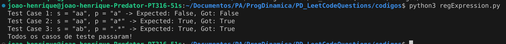
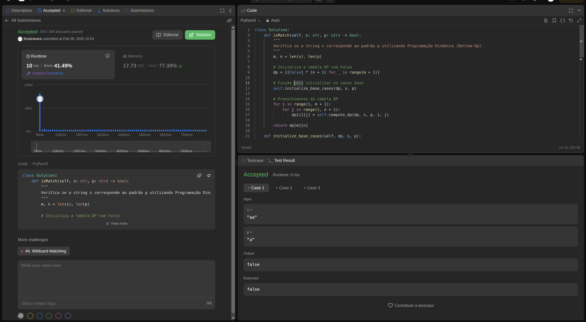
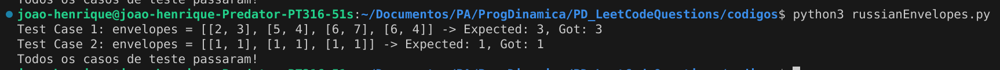
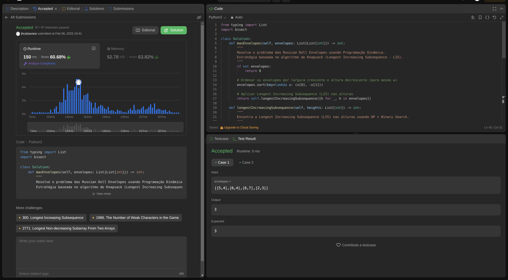

<!-- **!! Atenção: Renomeie o seu repositório para (Tema)_(NomeDoProjeto). !!** 

Temas:
 - Grafos1
 - Grafos2
 - PD
 - D&C
 - Greed
 - Final 
 
 **!! *Não coloque os nomes dos alunos no título do repositório*. Exemplo de título correto: Grafos2_Labirinto-do-Minotauro !!**
 
 (Apague essa seção) -->

# Leet Code Questions

**Número da Lista**: 7<br>
**Conteúdo da Disciplina**: Programação dinâmica<br>

## Alunos
|Matrícula | Aluno |
| -- | -- |
| 19/0085819  |  Cicero Barrozo Fernandes Filho |
| 20/0067923  |  João Henrique Marques Calzavara |

## Sobre 
&emsp;&emsp;Este projeto tem como objetivo desenvolver questões sobre o conteúdo ministrado de **Programação Dinâmica**, com foco nos algoritmos **Escalonamento de Intervalos Ponderado (Weighted Interval Scheduling)**, **Problema da Mochila (Knapsack)**, **Problema do Selo (Stamp Problem)**, **Similaridade de Strings (String Similarity)** e **Algoritmo de Bellman-Ford**. Para isso, serão elaboradas questões de média ou alta dificuldade, utilizando a plataforma de juíz online ***LeetCode***, que oferece uma vasta quantidade de desafios relacionados a esses temas.


## Questões

|Questão | Dificuldade | Código presente em:|
| -- | -- | -- |
| [10. Regular Expression Matching](https://leetcode.com/problems/regular-expression-matching/description/)  |  ***Difícil*** | [regExpression.py](codigos/regExpression.py) |
| [354. Russian Doll Envelopes](https://leetcode.com/problems/russian-doll-envelopes/description/)  |  ***Difícil*** | [russianEnvelopes.py](codigos/russianEnvelopes.py) |

## Screenshots
<!-- Adicione 3 ou mais screenshots do projeto em funcionamento. -->
### regExpression.py
- Rodando o arquivo python no terminal na pasta onde ele se encontra, após descomentar os testes no final do arquivo:
    - 
- Rodando o arquivo no ***Leet Code*** com seus testes passando e submissão aceita:
    - 
<br>

### russianEnvelopes.py
- Rodando o arquivo python no terminal na pasta onde ele se encontra, após descomentar os testes no final do arquivo:
    - 
- Rodando o arquivo no ***Leet Code*** com seus testes passando e submissão aceita:
    - 
<br>


## Instalação
**Linguagem**: Python<br>
<!-- **Framework**: (caso exista)<br>
Descreva os pré-requisitos para rodar o seu projeto e os comandos necessários. -->

## Uso 
<!-- Explique como usar seu projeto caso haja algum passo a passo após o comando de execução. -->
- Para rodar o projeto:
    - Faça o clone do repositório ou baixe o zip dele:
        - ```git clone https://github.com/projeto-de-algoritmos-2024/PD_LeetCodeQuestions.git ```
    - Após ter a pasta do projeto, rode no terminal de sua máquina dentro da pasta ***Leet_Code_Questions***,  descomente a main que está comentada dos testes no final dos arquivos .py, e execute os seguintes comandos:
        - ```python3 regExpression.py ```<br>
        - ```python3 russianEnvelopes.py ```<br>

    - Para testar no ***leet code***:
        - Entre nos ***links*** presentes na tabela de questões, copie o código da questão que quer testar, e clique em ***run*** ou ***submit*** para testar os códigos ***(lembre de deixar os a main comentada para testar no leet code)***.

## Link para o vídeo 

<!-- Adicionar link para o vídeo -->
